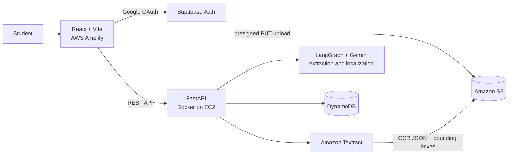

# CampusPilot

**Turn messy campus documents into a prioritized, localized, source-cited action queue.**

CampusPilot (formerly *Campus Workflow AI*) ingests the unstructured documents engineering students drown in, such as placement drive notices, scholarship circulars and exam schedules, and compiles them into structured tasks with deadlines, priorities and a link back to the exact spot in the original document that each task came from.

Built for the **WeMakeDevs "First Commit" hackathon** (AWS Bharat Builds Tour, Sept 17-20, 2026).

> **Live demo:** _coming soon_ &nbsp;|&nbsp; **Demo video:** _coming soon_

---

## The problem

Campus information arrives as PDFs, scanned notices, screenshots and forwarded files. Deadlines hide in paragraphs, eligibility criteria are buried in tables, and nobody knows which notice matters most this week. Students miss opportunities not because they are careless, but because the information is unstructured.

## What CampusPilot does

- **Upload anything document-shaped:** PDFs and images today, Office formats in progress (see [Supported formats](#supported-formats-and-known-limitations)).
- **Extract tasks automatically:** title, description, deadline, eligibility and required actions, validated against a strict schema.
- **Show your sources:** every task carries a citation (page, text and bounding box) so you can see exactly where in the document it came from. This is how you trust and verify an AI-extracted deadline.
- **Prioritize deterministically:** a transparent 0-100 score (urgency, deadline proximity, opportunity weight) mapped to HIGH / MEDIUM / LOW, with a human-readable justification for each task.
- **Speak your language:** task content is pre-translated to **Hindi** and **Kannada** at ingestion time, so switching language is instant.
- **Stay in control:** edit or update any task from the dashboard.
- **Sign in with Google:** per-user accounts through Supabase Auth.

## How it works



1. **Upload.** The frontend asks the backend for a presigned S3 URL and uploads the file directly to S3, so large files never pass through the API server.
2. **OCR.** Amazon Textract reads the document and returns text with layout and bounding-box geometry. The result is stored in S3.
3. **Extraction.** A LangGraph pipeline sends the OCR text to Gemini and validates the response against Pydantic models, with a retry-and-repair loop if the output doesn't conform.
4. **Normalization.** Tasks are cleaned, deduplicated and have their dates normalized.
5. **Prioritization.** A deterministic scoring service assigns the priority score, band and justification.
6. **Localization.** Task text is batch-translated to Hindi and Kannada in a couple of calls per document rather than one call per task.
7. **Persistence.** Documents, tasks, processing state and source references are written to a single DynamoDB table.
8. **Dashboard.** The frontend fetches and renders the task queue, with source highlighting and inline editing.

## Tech stack

| Layer | Technology |
|---|---|
| Frontend | React 18, TypeScript, Vite, Tailwind, shadcn/ui |
| Backend | Python 3.12, FastAPI, Pydantic, Uvicorn |
| AI orchestration | LangGraph, Google Gemini (`google-genai` SDK) |
| OCR | Amazon Textract |
| Storage | Amazon S3 (uploads and OCR output), Amazon DynamoDB (single-table design) |
| Auth | Supabase Auth (Google OAuth, JWT) with a `profiles` table in Supabase Postgres |
| Hosting | AWS Amplify (frontend), Docker on Amazon EC2 (backend) |
| Region | `ap-south-1` (Mumbai) |

## Repository structure

```
.
├── frontend/                 # React + TypeScript + Vite app
│   ├── src/
│   └── .env.example
├── backend/                  # FastAPI service
│   ├── app/
│   │   ├── ai/               # LangGraph pipeline, prompts, Gemini client
│   │   ├── api/              # Route handlers (documents, tasks, health)
│   │   ├── core/             # Settings, AWS clients, auth helpers
│   │   ├── models/           # Pydantic models (documents, tasks, enums)
│   │   ├── repositories/     # DynamoDB and S3 access
│   │   ├── services/         # Textract, priority, task and localization logic
│   │   ├── utils/
│   │   └── main.py
│   ├── tests/
│   ├── Dockerfile
│   ├── requirements.txt
│   └── .env.example
└── README.md
```

## Getting started (local development)

### Prerequisites

- Python 3.12+
- Node.js 18+
- An AWS account with credentials configured locally (`aws configure`), with access to S3, DynamoDB and Textract in `ap-south-1`
- A Google AI Studio API key for Gemini
- A Supabase project with Google sign-in enabled

### 1. Backend

```bash
cd backend
python -m venv .venv && source .venv/bin/activate   # Windows: .venv\Scripts\activate
pip install -r requirements.txt
cp .env.example .env                                  # then fill in the values
uvicorn app.main:app --reload --port 8000
```

Check it's alive: `GET http://localhost:8000/health` should return `{"status": "healthy"}`. Interactive API docs are at `http://localhost:8000/docs`.

### 2. Frontend

```bash
cd frontend
npm install
cp .env.example .env.local
npm run dev                                           # http://localhost:5173
```

### 3. Environment variables

`.env.example` in each folder is the authoritative list. In summary:

**Backend (`backend/.env`)**

| Variable | Purpose |
|---|---|
| `AWS_REGION` | AWS region, `ap-south-1` |
| S3 bucket name | Bucket for uploads and Textract output |
| DynamoDB table name | Single table for documents and tasks |
| Gemini API key and `GEMINI_MODEL_ID` | LLM access and model selection |
| `CORS_ORIGINS` | Comma-separated allowed frontend origins |
| Supabase JWT secret | Used to verify user tokens |

**Frontend (`frontend/.env.local`)**

| Variable | Purpose |
|---|---|
| `VITE_API_BASE_URL` | Backend URL, e.g. `http://localhost:8000` |
| `VITE_SUPABASE_URL` | Supabase project URL |
| `VITE_SUPABASE_ANON_KEY` | Supabase public anon key |

> Never commit `.env` files. The S3 bucket also needs a CORS rule allowing `PUT` from every frontend origin you use (localhost and the Amplify URL).

### 4. Tests and checks

```bash
cd backend && pytest
cd frontend && npm run build        # catches TypeScript errors before CI does
```

## Environments

Development and production run the **same code** and differ only by configuration:

| | Dev (your machine) | Production |
|---|---|---|
| Frontend | `npm run dev` on `localhost:5173` | AWS Amplify, built from `main` |
| Backend | `uvicorn --reload` on `localhost:8000` | Docker container on EC2 |
| DynamoDB table | dev table | separate prod table |
| S3 bucket | dev bucket | separate prod bucket |

Keeping the data resources separate means local testing never touches real users' data. Git flow: work on feature branches, merge to `main` only when ready, and merging to `main` triggers the frontend deployment.

## Deployment

### Frontend: AWS Amplify

1. Connect this repository in the Amplify console and select the `main` branch.
2. Set the app root to `frontend/`.
3. Add environment variables `VITE_API_BASE_URL`, `VITE_SUPABASE_URL` and `VITE_SUPABASE_ANON_KEY`.
4. Add a rewrite rule so client-side routes resolve to `/index.html` (SPA fallback).

### Backend: Docker on EC2

```bash
git pull
docker build -t campuspilot-backend:$(git rev-parse --short HEAD) ./backend
docker stop campuspilot && docker rm campuspilot
docker run -d --name campuspilot --restart unless-stopped -p 8000:8000 \
  --env-file /path/to/prod.env campuspilot-backend:<tag>
```

Tagging images by commit makes rollback a one-liner: run the previous tag. Put an HTTPS terminator (reverse proxy or load balancer) in front of the container, because the HTTPS Amplify site cannot call a plain-HTTP API.

### Release checklist

1. `pytest` and `npm run build` pass locally.
2. The Docker image builds and runs locally against dev resources.
3. Deploy the **backend first**, verify `/health`, then merge the frontend.
4. After the first deploy, update these with the real URLs:
   - Backend `CORS_ORIGINS`
   - Google Cloud Console OAuth **Authorized JavaScript origins**
   - Supabase **Authentication, URL Configuration** (Site URL and Redirect URLs)

## API overview

The full, always-current list lives at `/docs` (Swagger UI). Key routes:

| Method | Route | Purpose |
|---|---|---|
| `GET` | `/health` | Liveness check |
| `GET` | `/documents/{document_id}` | Document details and processing status |
| `POST` | `/documents/{document_id}/process` | Run OCR, extraction, prioritization and localization |
| `GET` | `/tasks` | List extracted tasks |
| `PATCH` | `/tasks/{task_id}` | Update a task |

## Design decisions

- **Source citations over blind trust.** Textract bounding boxes let every task point back to the exact region of the document, so users can verify AI output instead of taking it on faith.
- **Deterministic prioritization.** Priority is computed by transparent rules rather than asked of an LLM, so rankings are reproducible and explainable.
- **Localization at ingestion.** Translations are generated once, in batches, and stored with the task. Language switching is then instant and independent of live LLM availability.
- **Validated LLM output.** Every model response passes through Pydantic validation with a bounded retry-and-repair loop.
- **Single-table DynamoDB.** One table keyed by `SESSION#`/`DOC#`/`TASK#` entities keeps access patterns fast and the infrastructure simple.
- **Pluggable LLM provider.** Amazon Bedrock was the original target, but an account-level eligibility restriction blocked model invocation, so the extraction layer runs on Gemini behind a settings-driven model ID.
- **Synchronous processing for v1.** `/process` runs the pipeline in one request. This is fine at hackathon scale; see the roadmap for the async design.

## Supported formats and known limitations

| Format | Status |
|---|---|
| PDF, PNG, JPG, TIFF | Supported through Textract, with source highlighting |
| DOCX, PPTX, XLSX | In progress. Text is extracted locally (`python-docx`, `python-pptx`, `openpyxl`) and normalized to the same shape as Textract output. These formats have no page geometry, so source highlighting is replaced by a text-only citation. |

Other limitations:

- Processing is synchronous, so very long documents can take a while.
- Localization currently covers English, Hindi and Kannada.
- LLM extraction can be wrong. Confidence scores and source citations exist precisely so users can double-check.

## Acknowledgements

Built for the [WeMakeDevs](https://www.wemakedevs.org/) "First Commit" hackathon on the AWS Bharat Builds Tour.
